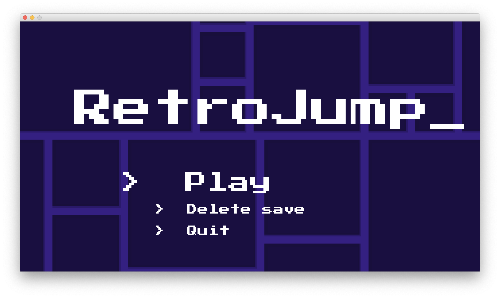
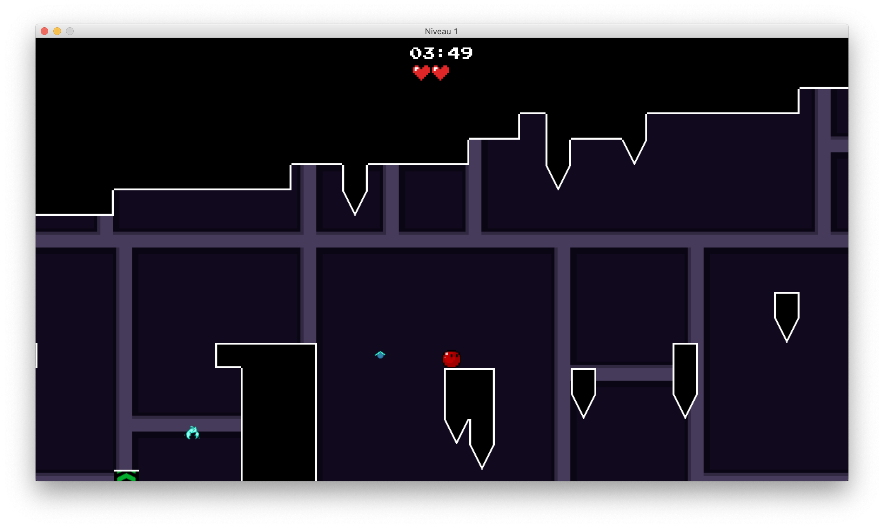
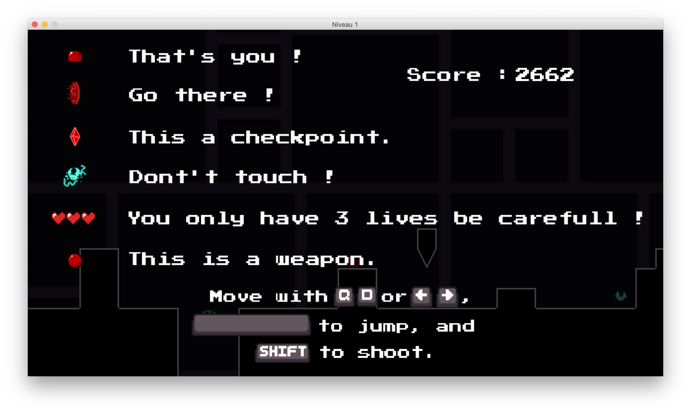
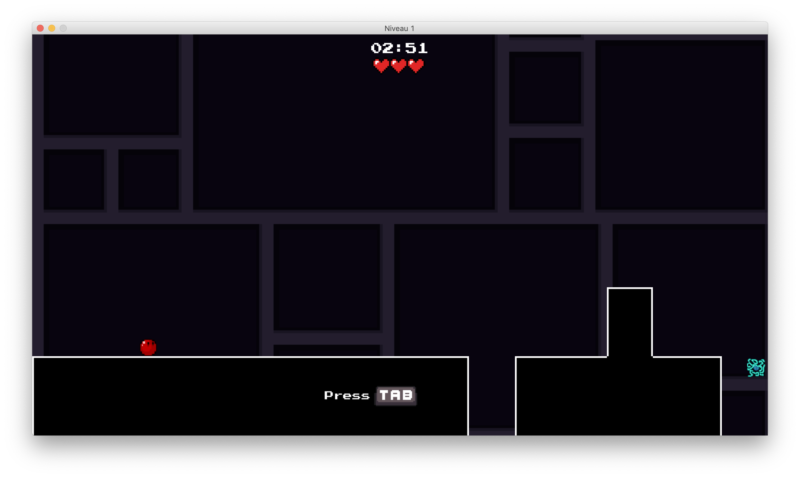

# Projet PI4

Projet d'Informatique S4 en L2 Informatique.

Le but de ce projet était de créer un jeu vidéo de type "plateformer" des années 80. Le langage à utiliser était le Java avec la bibliothèque graphique JavaFX.

> Plus de détails dans `docs/`... Le sujet est accessible [ici](docs/sujet.md).

## Gameplay

Le jeu est donc un jeu de plateforme, où l'on incarne un petit personnage rouge qui doit parcourir 3 niveaux où il doit passer outre les différents obstacles tels que des trous, des pics, des ennemis qui bougent et tirent des projectiles, etc.

Le joueur a 3 vies pour traverser chaque niveau ainsi que quelques checkpoints. Si les trois vies sont perdues, alors le joueur perd sa progression dans le niveau et recommence à partir de ce niveau.

Il y a en plus un système de score, le but étant de finir les 3 niveaux en ayant le score le plus faible possible. Le score augmente avec le temps et lorsque le joueur meurt.

Enfin, le jeu dispose d'une sauvegarde automatique afin de pouvoir reprendre la partie si on quitte le jeu.

## Screenshots

Voici quelques previews du jeu :

